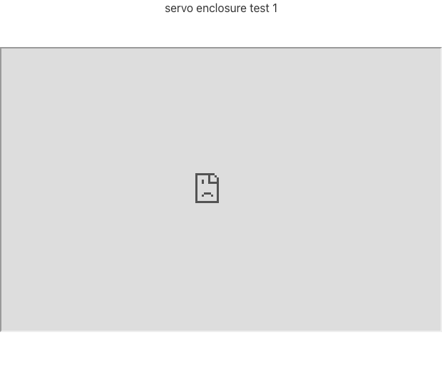
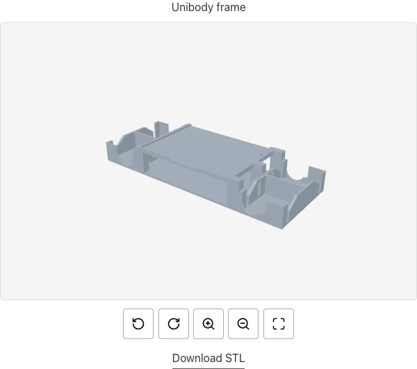
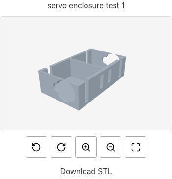
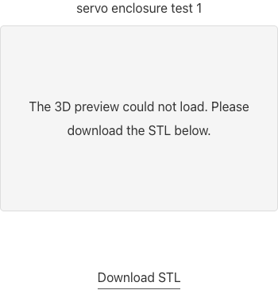

# BLOG-9 validation evidence — 2026-09-08

Original base: `72808ef9344f0705af5770d918134af2a343d97d`. UI review follow-up from `bd9a825d5678cbd03d3adbbf841a2e5ec1930463`: official pinned Lucide icon toolbar and screen-reader-only instructions. Viewer JavaScript, Three.js, models, article and theme are byte-for-byte unchanged from that review commit. Ruby 3.3.12; Node 26.8.1; existing Playwright Core 1.62.1 and Chrome 152.0.7977.76. No browser, global dependency or model-weight installation.

- Production strict Jekyll build: passed.
- Existing HTML-Proofer CI command: passed, 26 generated HTML files (external checks disabled and `/assets/` ignored, as in existing CI).
- Five Node regression checks (including Lucide source/license hashes and icon-only accessible markup): passed under both `/blog` and empty baseurl.
- Browser smoke: passed all 14 model renders, desktop drag/wheel and mobile touch/pinch, reset/keyboard/buttons, no idle render loop, offscreen context disposal and return, single same-origin model fetches, and five fallback scenarios. All 14 viewers also verified loaded official icons, 44×44 labeled buttons with title tooltips, stable height during activation and clipped instructions still referenced by the canvas. Desktop 1280×900 at DPR 1; mobile 390×844 at DPR 3 with renderer capped at DPR 2. Both successful contexts recorded zero console errors and zero page errors.
- OpenClaw-managed Chrome: inspected original production tab and local preview; screenshots below show desktop and mobile renderings. Local console errors: none. No horizontal overflow at 390 px.
- Article preservation: exact hash of original prose/code/markup outside the seven STL blocks; all 19 images and both YouTube embeds retained. Search of every blog post found no other solid embeds.

Whole-page `load`/`networkidle` waits timed out intermittently during testing. The final smoke waits for DOM content and actual model geometry/pixel readiness; it does not treat HTTP 200 or element presence as proof of rendering. External media functionality is outside this repair; the media URLs/markup are preserved. Mobile is Chrome touch emulation, not a physical iOS/Safari test. Independent review, CI verification, merge and deployed smoke belong to the coordinator.

## Representative screenshots

| Original production failure | Managed Chrome desktop |
| --- | --- |
|  |  |

| Managed Chrome mobile | Injected missing-model fallback |
| --- | --- |
|  |  |

## Actual geometry and pixel measurements

The committed [browser report](browser-report.json) contains tested source SHA-256 hashes plus per-model draw counts, pixel bounds/hashes, interaction hashes, model request URLs, and fallback results. Pixel counts sample every other row/column and scale by four. Every rendered geometry matched its original binary triangle count and fit inside its canvas.

| Model | Bytes | Triangles | Desktop model pixels | Mobile model pixels |
| --- | ---: | ---: | ---: | ---: |
| servo enclosure test 1 | 90,184 | 1,802 | 40,876 | 54,940 |
| servo enclosure test 2 | 129,884 | 2,596 | 39,300 | 52,848 |
| servo enclosure test 3 | 71,084 | 1,420 | 37,048 | 49,876 |
| leg test 1 | 34,684 | 692 | 28,088 | 37,796 |
| leg test 2 left | 45,384 | 906 | 22,256 | 29,996 |
| leg test 2 right | 47,584 | 950 | 20,064 | 27,012 |
| Unibody frame | 363,684 | 7,272 | 25,328 | 34,076 |
